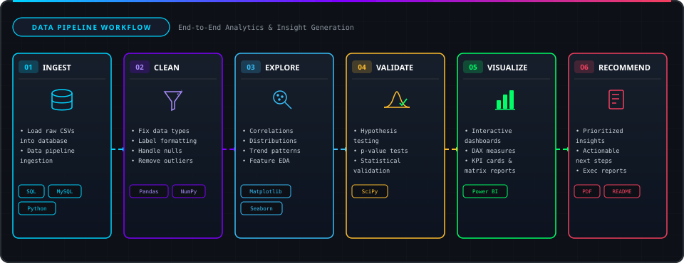

  
  # Nitin Salunke
  
  

    

  <!-- Header Animations -->
  

---

## 🙋‍♂️ About Me

<table>
<tr>
<td width="60%" valign="top">

I'm a fresher breaking into the IT industry as a Data Analyst. I build end-to-end analytics projects: clean messy data, query it with SQL, explore and test it in Python, and present insights in Power BI dashboards, always ending with clear, business-ready recommendations.

- 🔭 **Building**: Portfolio projects in retail, supply chain, and e-commerce analytics
- 🌱 **Learning**: Advanced SQL, statistics, and AI tools for data analysis
- 🎯 **Looking for**: Data Analyst / Junior Analyst roles
- 📫 **Reach me**: nitinsalunke1697@gmail.com

</td>
<td width="40%" align="center" valign="middle">

</td>
</tr>
</table>

---

## ⚙️ How I Work

  

---

## 🛠️ Tech Stack

### 💻 Languages & Databases

### 📊 Data Analysis & Visualization

### 🧰 Tools

---

## 📊 GitHub Analytics Dashboard

 

  

---

## 🏆 GitHub Trophies

---

## 🐍 Contribution Snake

⚙️ Generated automatically via GitHub Actions

---

## 🤝 Let's Connect

    

  💬 **Open to Data Analyst opportunities. Let's talk data!**

  

